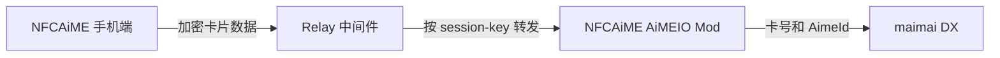

# NFCAiME AiMEIO

NFCAiME AiMEIO 是配合 [NFCAiME 手机端](https://github.com/Project-HashCat/NFCAiME) 使用的 maimai DX MelonLoader Mod。

手机读取 AiMe 卡后，通过 Relay 将卡片数据发送到运行游戏的电脑；Mod 接收数据并注入游戏现有读卡流程。电脑端不需要 PC Kit、共享内存或额外常驻程序。

## 工作流程



> **点对点加密：** NFCAiME 手机端会在发送前使用 AES-GCM 加密卡片数据，只有电脑端 AiMEIO Mod 负责解密。Relay 服务器仅根据 `session-key` 转发密文，不持有解密密钥，也不会获得卡号、IDm、AimeId 等明文内容。

- Relay 只负责按 `session-key` 转发数据，不保存卡片记录。
- Mod 收到数据后默认缓存 5 秒，过期数据不会继续用于登录。
- `session-key` 是路由标识，不是账号密码。请勿公开自己的 key。

## 运行环境

- maimai DX（例如 MuNET 等玩家服务器）

## 安装

> 本项目是基于 [NFCAiME](https://github.com/Project-HashCat/NFCAiME) 开发的电脑端配套插件，必须依赖 NFCAiME App 使用，不能单独完成手机 NFC 读卡。

App 项目：<https://github.com/Project-HashCat/NFCAiME>

### 1. 生成 session-key

访问：

<https://card.segasb.me/nfc-session-key>

生成一个以 `nfcaime-` 开头的 session-key。手机端与电脑端必须填写同一个 key。

### 2. 下载 Mod

从 [Releases](https://github.com/Project-HashCat/NFCAiME-AiMEIO/releases) 下载最新压缩包。

将文件放置为：

```text
Package/
├─ NFCAiME.AimeIO.Mod.toml
└─ Mods/
   └─ NFCAiME.AimeIO.Mod.dll
```

不要把 TOML 放进 `Mods`，也不要在 `segatools.ini` 中新增 `[aimeio]` 配置。

### 3. 配置 TOML

编辑 `Package/NFCAiME.AimeIO.Mod.toml`：

```toml
serverUrl = "https://card.segasb.me/"
session-key = "nfcaime-xxxxxxxx"
```

只需要配置 `serverUrl` 和 `session-key`。

Mod 会自动读取游戏现有的 `segatools.ini` 配置，无需在 TOML 中重复填写。支持 `Package/segatools.ini` 与 `Package/AMDaemon/segatools.ini` 两种常见位置。

Relay 可以选择：

- 公共服务器：`https://card.segasb.me`
- 自建服务器：克隆本仓库并部署 `relay/` 目录，然后将 `serverUrl` 改为自己的 Relay 地址

使用自建服务器时，手机端与 TOML 中的 Relay 地址必须同时修改并保持一致。

### 4. 配置手机端

在 NFCAiME 的 AiMEIO 页面填写：

- Relay 地址：与 TOML 的 `serverUrl` 相同。
- session-key：与 TOML 的 `session-key` 完全相同。

启动游戏，MelonLoader 出现以下日志后即可从手机发送卡片：

```text
[NFCAiME] connecting relay: wss://...
[NFCAiME] relay online
```

## 配置说明

| 配置项 | 默认值 | 说明 |
| --- | --- | --- |
| `serverUrl` | `https://card.segasb.me/` | Relay 地址，自动转换为 WebSocket 地址 |
| `session-key` | 空 | 手机端与电脑端共用的会话路由 key |

## 常见问题

### `session-key is empty`

确认配置文件位于 `Package/NFCAiME.AimeIO.Mod.toml`，并填写了 `session-key`。

### `aimeDbHost is empty`

确认 `segatools.ini` 位于受支持的位置，且包含 `[DNS] AimeDB=...`、`[KeyChip] GameID=...` 和 `ID=...`。

## 从源码构建

构建需要本地游戏程序集和与 NFCAiME 手机端匹配的传输密钥：

```powershell
dotnet build .\NFCAiME.AimeIO.Mod\NFCAiME.AimeIO.Mod.csproj `
  -c Release `
  /p:GameDir="D:\SDGA\Package" `
  /p:NFCAIME_AES_KEY_HEX="<64位十六进制密钥>"
```

输出文件：

```text
build/NFCAiME.AimeIO.Mod.dll
```

自行构建时，手机端与 DLL 必须使用相同密钥，否则加密 payload 无法解密。

## 使用说明

本项目用于个人持有卡片的兼容性测试、开发研究与交流学习使用。

下载后请在 24 小时内删除。

本项目使用 [MIT License](LICENSE) 协议。
